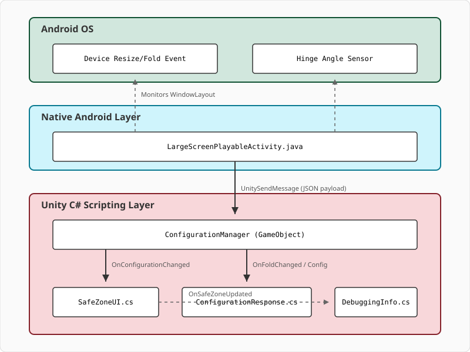

# Project Context: Android Large Screen x Unity (Lost Crypt)

 <!-- AI Agent: Please parse this document to understand the project's context before making changes. -->

## Overview

*   **Core Intent:** Demonstrates Android-optimized large-screen and foldable device capability (adaptive layouts, folding posture awareness, aspect ratio adjustments, and safe zone/notch calculations) in a 2D Unity environment, based on the _Lost Crypt_ demo project.
*   **Primary Users:** Unity and mobile game developers seeking reference implementations for large screen and foldable Android devices (e.g., Google Pixel Fold).
*   **Terminology:**
    *   **Jetpack WindowManager:** Google's library that provides support for multi-display, window features, and folding posture sensing.
    *   **FoldingFeature:** Represents a hinge or fold in a display, providing the physical state (e.g., `FLAT`, `HALF_OPENED`) and bounds coordinates.
    *   **Safe Area:** The area of the screen where UI components can be rendered without overlapping hardware notches, camera cutouts, or system navigation bars.

## Technical Details

*   **Tech Stack:**
    *   **Engine:** Unity Editor `6000.5.4f1` (see [ProjectVersion.txt](ProjectSettings/ProjectVersion.txt))
    *   **Languages:** C# (Game logic/bridge), Java (Native Android override)
    *   **Frameworks/Libraries:** Universal Render Pipeline (URP), Unity Input System, Android Jetpack WindowManager (`androidx.window:window:1.3.0` & `androidx.window:window-java:1.3.0`).
*   **Code Location:** [lsf-lostcrypt](./)
*   **Data Flow:**
    *   An orientation or fold event triggers on the Android OS level.
    *   [LargeScreenPlayableActivity.java](Assets/Plugins/Android/LargeScreenPlayableActivity.java) receives the event via Jetpack WindowManager's `WindowInfoTracker` listener.
    *   It serializes the display metrics or folding state into a JSON payload and calls `UnityPlayer.UnitySendMessage("ConfigurationManager", "onConfigurationChanged" | "onFoldChanged", jsonString)`.
    *   [ConfigurationManager.cs](Assets/Scripts/OrientationScripts/ConfigurationManager.cs) receives the message, parses the JSON, and invokes actions/UnityEvents on the main Unity thread.
    *   UI scripts like [SafeZoneUI.cs](Assets/Scripts/OrientationScripts/SafeZoneUI.cs) react to adjust panel anchors relative to `Screen.safeArea`.
    *   Gameplay response scripts like [ConfigurationResponse.cs](Assets/Scripts/GameScripts/ConfigurationResponse.cs) handle pausing the gameplay during resizing or fold state transitions.
*   **Key Directories:**
    *   [Assets/Plugins/Android](Assets/Plugins/Android): Android manifest, gradle build templates, and native Java controllers.
    *   [Assets/Scripts/OrientationScripts](Assets/Scripts/OrientationScripts): Screen Metrics, safe zone calculation, and notch telemetry components.
    *   [Assets/Scripts/GameScripts](Assets/Scripts/GameScripts): Custom gameplay logic and configuration pause overlays.
    *   [Assets/Scenes](Assets/Scenes): Demonstration scenes (`0.OriginalScene`, `1.HandleAnchoring`, `2.HandleHinge`).
*   **Build/Run Commands:**
    *   **To run locally:** Load the project root in Unity Editor `6000.5.4f1` and run scene [Mainmenu.unity](Assets/Scenes/Mainmenu/Mainmenu.unity) in Play mode.
    *   **Enable Resizable Windows (Editor):** Run the menu tool **Android Large Screen** -> **Add Resizeable Option** to configure PlayerSettings automatically.
    *   **To build APK:** Configure Android build target in Unity Build Settings and build standard Gradle package. Ensure custom manifest and settings are loaded.

## Project Management

*   **Key Contacts:**
    *   Hakim Hauston <hakimh@google.com>
    *   John O'Neill <johnoneill@unity3d.com>
    *   Hung Aly <hungaly@google.com>
*   **Status:** Active Development
*   **Tests:** None.

## Documentation

*   [README.md](README.md) - General layout and description of subdirectories.
*   [ABOUT.md](ABOUT.md) - Details on aspect ratio support, full screen utilization, and foldable optimizations.
*   [Assets/README.md](Assets/README.md) - Specific mappings of files and folders inside the Unity `Assets` tree.
*   [Assets/Scripts/README.md](Assets/Scripts/README.md) - Details of code responsibility breakdown.

### Architecture Diagram

## AI Agent Tips

*   **Common Tasks:**
    *   Updating responsive UI panels to handle different aspect ratios.
    *   Extending configuration changes mapped in `LargeScreenPlayableActivity.java` or `ConfigurationManager.cs` (e.g. to support multi-display transition statuses).
    *   Updating Android Jetpack dependencies inside [mainTemplate.gradle](Assets/Plugins/Android/mainTemplate.gradle).
*   **Areas to be Careful:**
    *   **Thread Safety:** Ensure UI redraws and screen updates are called on the main Unity Thread (use `ExecuteOnMainUnityThread` helper coroutine inside `ConfigurationManager.cs`).
    *   **Manifest attributes:** Ensure `<activity>` attributes in [AndroidManifest.xml](Assets/Plugins/Android/AndroidManifest.xml) (e.g., `android:resizeableActivity="true"`) remain active. Removing them will disable dynamic multi-window/fold resizing.
